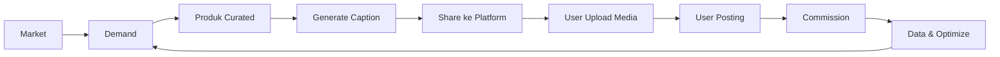
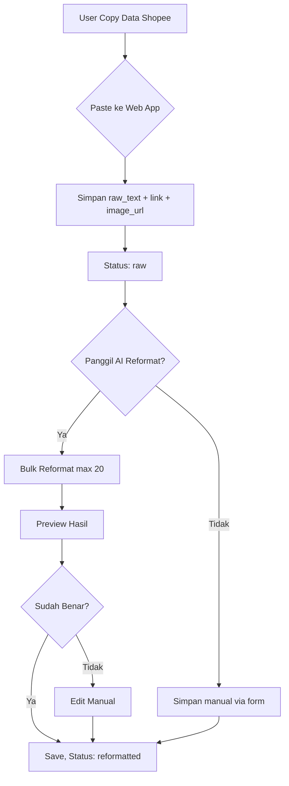
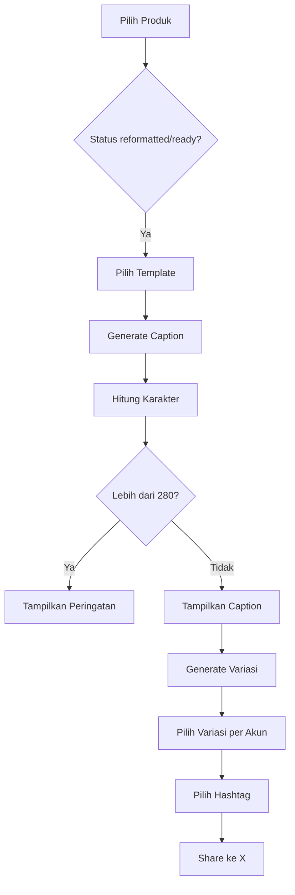
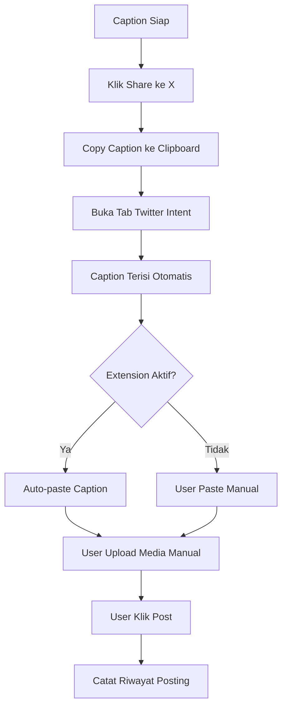
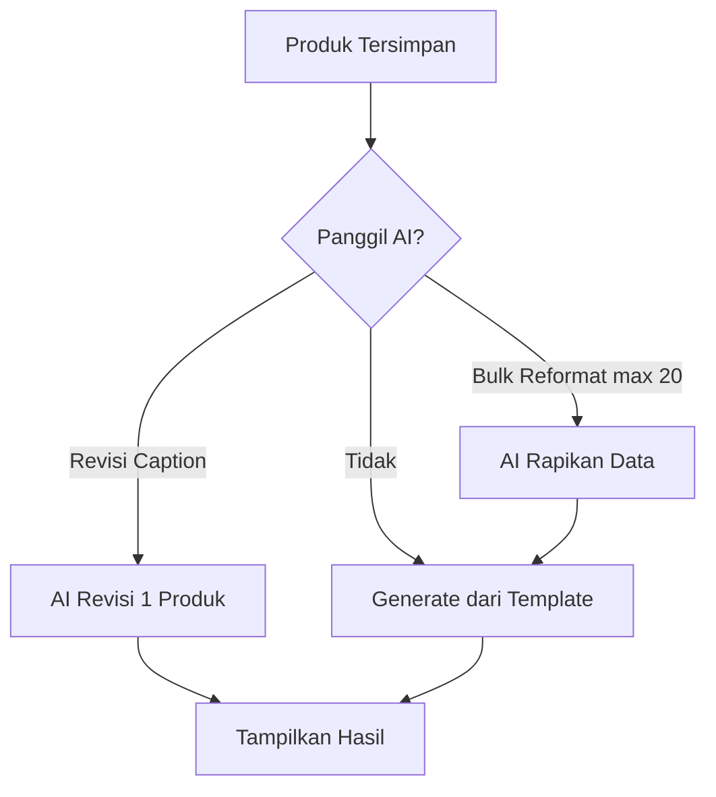

# Product Requirements Document — AffiliatorShopee

## 1. Overview

AffiliatorShopee adalah web app pribadi untuk menyimpan produk affiliate Shopee yang sudah dikurasi, lalu memudahkan pembuatan caption dan posting ke banyak akun/platform.

Fokus pertama: dipakai sendiri oleh owner. Fitur monetisasi, multi-user, dan admin ditunda ke masa depan.

## 2. Tujuan

- Menyimpan produk curated dalam satu database
- Mempercepat pembuatan caption affiliate yang mengikuti ilmu market ekonomi
- Membantu posting ke banyak akun tanpa harus menyusun ulang dari nol
- Mengurangi gesekan antara ide produk → caption → posting

## 3. Non-Goals

- Bukan auto-posting penuh yang mengabaikan keamanan akun
- Bukan platform publik atau SaaS di fase awal
- Bukan scraping otomatis Shopee
- Bukan analitik/dashboard kompleks
- Tidak ada autentikasi multi-user di MVP

## 4. Target User

- Owner sendiri sebagai operator
- Kemungkinan asisten atau tim kecil owner di masa depan

## 5. Masalah yang Diselesaikan

Posting produk affiliate secara manual memakan waktu karena:

- harus membuka banyak tab produk
- caption dibuat dari nol setiap kali
- susah mengingat produk mana yang sudah diposting
- susah membedakan angle untuk akun yang berbeda
- hashtag sering dipilih asal-asalan

## 6. Solusi

Web app dengan fitur:

1. Simpan produk dengan data mentah dari Shopee
2. AI merapikan data mentah menjadi field lengkap
3. Generate caption dari template yang sudah teruji
4. Pilih hashtag berdasarkan cluster
5. Buat variasi caption untuk beda akun
6. Tombol share ke X/Threads yang membuka tab dengan caption terisi
7. Chrome extension membantu auto-paste caption
8. Gambar/video tetap di-upload manual oleh user

## 7. Flowchart Bisnis

### 7.1 Flow Bisnis Utama



### 7.2 Flow Input Produk



### 7.3 Flow Generate Caption



### 7.4 Flow Posting ke X



### 7.5 Flow AI Helper



## 8. Status Produk

| Status | Arti |
|---|---|
| raw | Baru dicopas dari Shopee, belum direformat |
| reformatted | Sudah AI reformat, bisa diedit |
| ready | Data lengkap, siap generate caption |
| posted | Sudah pernah diposting (bisa repost dengan variasi lain) |

## 9. Fitur MVP

### 9.1 Manajemen Produk

- Tambah produk via paste data mentah dari Shopee
- Simpan link affiliate dan image URL
- Edit dan hapus produk
- Status workflow: raw → reformatted → ready → posted

### 9.2 AI Reformat

- Pilih produk dengan checkbox, maksimal 20 per bulk
- AI merapikan data mentah jadi field lengkap
- Preview hasil sebelum disimpan
- Edit manual jika perlu

### 9.3 Caption Generator

- Template bawaan:
  - Direct Product
  - Keyword + Recommendation
  - Problem-specific
  - Cheap / Value
- Generate caption otomatis dari data produk
- Hitung jumlah karakter
- Peringatan jika melebihi batas X

### 9.4 Variasi Caption

- Satu produk bisa punya beberapa variasi caption
- Variasi digunakan untuk beda akun/platform
- Variasi dibuat dari template, bisa edit manual

### 9.5 Hashtag Selector

- Pool hashtag per cluster
- Pilih 1–3 hashtag relevan
- Bisa custom hashtag

### 9.6 Share ke Platform

- Tombol "Share ke X" menggunakan Twitter Web Intent
- Caption terisi otomatis di tab baru
- Caption juga disalin ke clipboard
- Chrome extension membantu auto-paste caption
- Media di-upload manual oleh user

### 9.7 Riwayat Posting Sederhana

- Tandai produk sudah diposting di akun mana
- Catatan tanggal posting
- Satu produk bisa punya banyak post_logs untuk akun berbeda

### 9.8 Manajemen Akun

- Tambah daftar akun affiliate
- Platform dan tipe akun: capture, cheap, branded

## 10. User Flow MVP

```text
1. User buka web app
2. User paste data mentah dari Shopee
3. User paste link affiliate dan image URL
4. User klik "Simpan Produk", status = raw
5. User pilih beberapa produk (max 20) dan klik "Bulk Reformat AI"
6. AI merapikan data, user preview dan edit
7. User save, status = reformatted/ready
8. User pilih produk, pilih template, generate caption
9. User pilih variasi dan hashtag
10. User pilih akun target
11. User klik "Share ke X"
12. Caption tersalin ke clipboard, tab X terbuka
13. Chrome extension (jika aktif) auto-paste caption
14. User upload media manual dan klik Post
15. User kembali ke web app, tandai sudah diposting
```

## 11. Data Produk

| Field | Tipe | Keterangan |
|---|---|---|
| id | UUID | ID unik |
| raw_text | text | Data mentah dari Shopee |
| product_name | string | Nama produk |
| shopee_link | string | Link affiliate |
| image_url | string | URL gambar utama |
| image_urls | string[] | Daftar URL gambar tambahan |
| video_url | string | URL video |
| normal_price | integer | Harga normal |
| sale_price | integer | Harga diskon |
| discount_percent | integer | Persentase diskon |
| rating | float | Rating produk |
| sold_count | string | Jumlah terjual |
| review_count | string | Jumlah penilaian |
| cluster | string | Kategori/cluster |
| model | enum | cheap / branded |
| benefit_1 | string | Benefit utama |
| benefit_2 | string | Benefit kedua |
| benefit_3 | string | Benefit ketiga |
| urgency | string | Voucher, stok, PO, flash sale |
| caption_template | string | Template default |
| hashtag_pool | string[] | Pilihan hashtag |
| notes | text | Catatan tambahan |
| status | enum | raw / reformatted / ready / posted |
| created_at | datetime | Waktu dibuat |
| updated_at | datetime | Waktu diupdate |

## 12. Model Konten yang Didukung

| Model | Channel | Karakteristik |
|---|---|---|
| 4 Capture Models | X Akun 1 | Search, Reply, Trend, Problem Capture |
| Curated Cheap/Value | X Akun 2 | Produk murah, berguna, deal |
| Curated Branded | Threads | Brand dikenal, diskon, voucher, promo |

## 13. Aturan Caption

- Hook dari keyword, problem, atau value
- Benefit maksimal 3 poin
- Proof berdasarkan data nyata: rating, terjual, review
- Harga/offer transparan
- Urgency hanya kalau punya dasar nyata
- CTA sederhana
- Hashtag relevan, maksimal 3

## 14. Batasan dan Keputusan Desain

- Tidak ada auto-posting penuh
- Media di-upload manual oleh user
- Chrome extension hanya membantu paste caption, bukan klik Post otomatis
- Tidak ada scraping Shopee otomatis
- Input produk dari copy-paste user
- AI dipakai terbatas untuk reformat dan revisi, bukan generate semua caption
- Bulk reformat AI maksimal 20 produk per request

## 15. Acceptance Criteria

### AC-1: Tambah Produk

Diberikan user di halaman tambah produk, ketika paste data mentah dari Shopee, link, dan image URL, maka produk tersimpan dengan status raw.

### AC-2: Bulk Reformat AI

Diberikan user memilih maksimal 20 produk dengan status raw, ketika klik "Bulk Reformat", maka AI merapikan data dan menampilkan preview yang bisa diedit.

### AC-3: Generate Caption

Diberikan produk dengan status reformatted/ready, ketika user pilih template dan klik generate, maka caption muncul sesuai format dan jumlah karakter ditampilkan.

### AC-4: Share ke X

Diberikan caption sudah jadi, ketika user klik "Share ke X", maka caption tersalin ke clipboard dan tab baru terbuka ke Twitter intent dengan caption ter-encode.

### AC-5: Riwayat Posting

Diberikan user sudah posting produk, ketika user kembali ke web app dan klik "Tandai Sudah Diposting", maka post_log tercatat dengan akun dan tanggal.

### AC-6: Variasi Caption

Diberikan satu produk, ketika user klik "Buat Variasi", maka muncul 2–3 versi caption berbeda yang bisa dipilih untuk akun berbeda.

## 16. Success Metrics

- Waktu dari input produk sampai caption jadi berkurang
- Jumlah produk yang tersimpan dan terkurasi meningkat
- User bisa posting ke beberapa akun tanpa membuat caption dari nol
- Tidak ada akun yang kena suspend karena automation

## 17. Risiko dan Asumsi

| Risiko | Mitigasi |
|---|---|
| X mengubah Twitter Intent | Siapkan fallback manual copy-paste |
| AI reformat tidak sempurna | Selalu ada mode edit manual |
| AI boros token | Bulk reformat max 20, tidak otomatis |
| Extension tidak bisa diinstall | Tetap bisa pakai share intent dan clipboard |

## 18. Future Roadmap

- Autentikasi dan multi-user
- Admin panel
- Dashboard analytics
- Scheduling post
- Integrasi lebih dalam dengan X API
- Opsi dijual sebagai SaaS
- Support platform lain: TikTok, Instagram, Facebook

## 19. Catatan

Dokumen ini adalah PRD untuk fase pribadi/MVP. TRD menyusul dengan detail teknis stack dan arsitektur.
