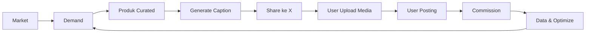
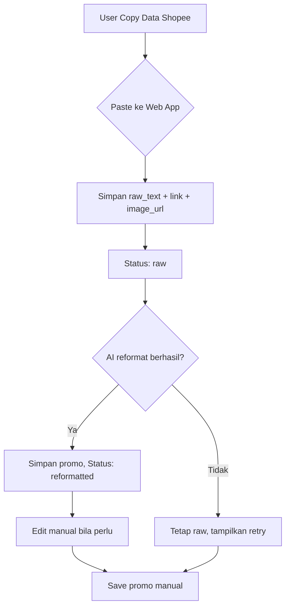
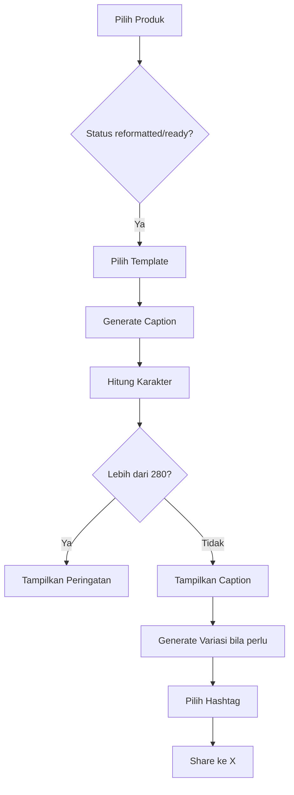
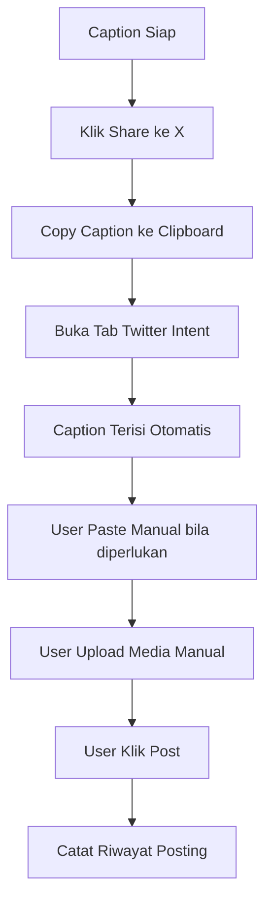
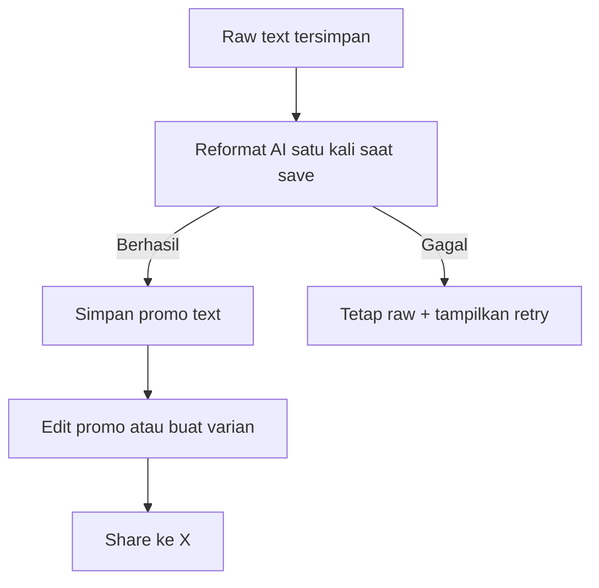

# Product Requirements Document — AffiliatorShopee

## 1. Overview

AffiliatorShopee adalah web app pribadi untuk menyimpan produk affiliate Shopee yang sudah dikurasi, lalu memudahkan pembuatan caption dan posting berulang ke X.

Fokus pertama: dipakai sendiri oleh owner. Fitur monetisasi, autentikasi operator/tim, dan admin ditunda ke masa depan.

## 2. Tujuan

- Menyimpan produk curated dalam satu database
- Mempercepat pembuatan caption affiliate yang mengikuti ilmu market ekonomi
- Membantu posting ulang tanpa harus menyusun caption dari nol
- Mengurangi gesekan antara ide produk → caption → posting

## 3. Non-Goals

- Bukan auto-posting penuh yang mengabaikan keamanan akun
- Bukan platform publik atau SaaS di fase awal
- Bukan scraping server-side otomatis; scraping dilakukan saat user membuka halaman Shopee melalui extension scraper
- Bukan analitik/dashboard kompleks
- Tidak ada autentikasi operator/tim di MVP

## 4. Target User

- Owner sendiri sebagai operator
- Kemungkinan asisten atau tim kecil owner di masa depan

## 5. Masalah yang Diselesaikan

Posting produk affiliate secara manual memakan waktu karena:

- harus membuka banyak tab produk
- caption dibuat dari nol setiap kali
- susah mengingat produk mana yang sudah diposting
- susah memakai angle yang berbeda untuk satu produk
- hashtag sering dipilih asal-asalan

## 6. Solusi

Web app dengan fitur:

1. Simpan raw text dari paste, import X, atau scraper Shopee
2. Saat produk raw disimpan, AI mencoba membuat satu promo text berdasarkan content model; provider dapat dipilih dari OpenRouter, 9router, OpenCode, atau Codex CLI bridge lokal
3. Generate variasi caption terpisah dari promo yang sudah ada
4. Pilih hashtag berdasarkan cluster
5. Tombol share ke X yang membuka composer dengan caption dan media lokal
6. Download beberapa URL gambar dan URL video ke local storage agar mudah di-upload manual ke X
7. Catat riwayat posting tanpa menyimpan identitas akun X

## 7. Flowchart Bisnis

### 7.1 Flow Bisnis Utama



### 7.2 Flow Input Produk



### 7.3 Flow Generate Caption



### 7.4 Flow Posting ke X



### 7.5 Flow AI Helper



## 8. Status Produk

| Status | Arti |
|---|---|
| raw | Baru dicopas dari Shopee, belum direformat |
| reformatted | Sudah AI reformat, bisa diedit |
| ready | Data sudah siap digunakan untuk membuat caption |

## 9. Fitur MVP

### 9.1 Manajemen Produk

- Tambah produk via paste data mentah dari Shopee
- Simpan link affiliate dan image URL
- Edit dan hapus produk
- Status workflow: raw → reformatted → ready; produk yang di-reset kembali memerlukan reformat
- Riwayat posting disimpan di `post_logs`; posting ulang tidak mengubah status produk
- Produk raw dengan raw text dibuatkan promo otomatis sekali saat save; jika AI gagal, produk tetap tersimpan raw dan tombol `Reformat AI` aktif di detail
- `Reformat AI` memakai raw text saja; `Reformat varian caption` memakai promo yang sudah ada dan tetap terpisah

### 9.2 AI Reformat

- Produk baru dengan raw text memanggil AI satu kali saat save
- Detail menyediakan tombol retry `Reformat AI` untuk produk raw atau promo yang kosong
- Dashboard dapat menjalankan bulk reformat maksimal 10 produk bila tersedia di UI
- AI menghasilkan promo text berdasarkan content model `trending`, `branded`, atau `cheap`
- Hasil AI langsung disimpan ke produk
- Jika gagal, raw text tetap tersimpan dan error ditampilkan; reset menghapus promo dan mengaktifkan reformat ulang
- Edit manual tetap tersedia setelah reformat
- Codex CLI tersedia sebagai provider lokal melalui bridge host; terminal bridge harus aktif selama request.

### 9.3 Caption Generator

- Template bawaan:
  - Direct Product
  - Keyword + Recommendation
  - Problem-specific
  - Cheap / Value
- Generate caption otomatis dari data produk
- Hitung jumlah karakter
- Peringatan jika melebihi batas X

### 9.4 Variasi Caption

- Satu produk bisa punya beberapa variasi caption
- Variasi digunakan untuk posting ulang atau angle berbeda
- Variasi dibuat dari template, bisa edit manual

### 9.5 Hashtag Selector

- Pool hashtag per cluster
- Pilih 1–3 hashtag relevan
- Bisa custom hashtag

### 9.6 Share ke X

- Tombol "Share ke X" menggunakan Twitter Web Intent
- Caption terisi otomatis di tab baru
- Caption juga disalin ke clipboard
- Media di-upload manual oleh user setelah tersedia di local storage
- URL gambar/video di-download ke local storage saat produk disimpan
- Caption final yang dibagikan sudah mencakup hashtag yang dipilih

### 9.7 Riwayat Posting Sederhana

- Catat caption, hashtag, platform, dan tanggal setiap posting
- Satu produk bisa memiliki banyak `post_logs`, termasuk posting berulang

### 9.8 Media Local

- Satu produk dapat memiliki nol atau banyak image URL.
- Satu produk dapat memiliki satu video URL.
- Tersedia tombol `+ Add image URL` pada form input.
- Saat produk disimpan, backend mencoba men-download setiap URL ke local storage.
- URL `.mp4` diperlakukan sebagai video dan disimpan sebagai file lokal.
- Download yang gagal tidak membatalkan penyimpanan produk; error ditampilkan pada response.
- User dapat melihat metadata media dan men-download semua media sebagai ZIP.

## 10. User Flow MVP

```text
1. User buka web app
2. User paste data mentah dari Shopee
3. User paste link affiliate, beberapa image URL, dan video URL jika ada
4. User klik "Simpan Produk", status = raw
5. Sistem mencoba men-download media ke local storage
6. Jika raw text tersedia, sistem mencoba reformat AI satu kali; jika gagal, produk tetap raw
7. User edit promo atau klik retry `Reformat AI` dari detail
8. User dapat membuat `Reformat varian caption` dari promo saat ini
9. User klik "Share ke X"
10. Caption tersalin ke clipboard, tab X terbuka, extension membantu mengisi media lokal
11. User upload media lokal dan klik Post
12. User kembali ke web app dan mencatat posting
```

## 11. Data Produk

| Field | Tipe | Keterangan |
|---|---|---|
| id | UUID | ID unik |
| raw_text | text | Data mentah dari Shopee |
| product_name | string | Nama produk |
| shopee_link | string | Link affiliate |
| image_url | string | URL gambar utama |
| image_urls | string[] | Daftar URL gambar tambahan |
| video_url | string | URL video |
| normal_price | integer | Harga normal |
| sale_price | integer | Harga diskon |
| discount_percent | integer | Persentase diskon |
| rating | float | Rating produk |
| sold_count | string | Jumlah terjual |
| review_count | string | Jumlah penilaian |
| cluster | string | Kategori/cluster |
| keyword | string | Keyword utama untuk hook |
| problem | string | Problem yang ingin diangkat |
| content_model | enum | capture legacy / cheap / trending / branded |
| capture_angle | enum | search / reply / trend / problem |
| benefit_1 | string | Benefit utama |
| benefit_2 | string | Benefit kedua |
| benefit_3 | string | Benefit ketiga |
| urgency | string | Voucher, stok, PO, flash sale |
| caption_template | string | Template default |
| hashtag_pool | string[] | Pilihan hashtag |
| notes | text | Catatan tambahan |
| status | enum | raw / reformatted / ready |
| created_at | datetime | Waktu dibuat |
| updated_at | datetime | Waktu diupdate |

## 12. Model Konten yang Didukung

| Model | Channel | Karakteristik |
|---|---|---|
| Trending | X | Demand/momen yang sedang panas, lalu produk sebagai jawaban |
| Branded | X | Reminder brand yang sudah dipercaya + diskon/deal/urgency faktual |
| Murah | X | Harga termurah + kegunaan nyata + proof/value |
| Capture legacy | X | Search, Reply, Trend, Problem Capture; dipetakan ke Trending |

## 13. Aturan Caption

- Hook dari keyword, problem, atau value
- Benefit maksimal 3 poin
- Proof berdasarkan data nyata: rating, terjual, review
- Harga/offer transparan
- Urgency hanya kalau punya dasar nyata
- CTA sederhana
- Hashtag relevan, maksimal 3

## 14. Batasan dan Keputusan Desain

- Tidak ada auto-posting penuh
- Media di-download ke local storage oleh app, lalu di-upload manual oleh user ke X
- Tidak ada scraping server-side otomatis; extension scraper mengambil data saat halaman Shopee dibuka user
- Input produk dari copy-paste user
- AI menghasilkan promo text dari raw text; reformat varian caption adalah operasi terpisah
- Bulk reformat AI maksimal 10 produk per request
- Web app tidak login, memilih, atau menyimpan identitas akun X
- Chrome Extension Manifest V3 untuk helper X dan scraper Shopee dikelola sebagai dua extension terpisah yang mendukung web app
- Threads bukan bagian MVP awal

## 15. Acceptance Criteria

### AC-1: Tambah Produk

Diberikan user di halaman tambah produk, ketika paste raw text atau mengirim hasil scraper/import, maka produk tersimpan. Jika raw text tersedia, sistem mencoba reformat AI satu kali; kegagalan tidak membatalkan penyimpanan.

### AC-1b: Reformat Manual

Diberikan produk berstatus raw, ketika user mengisi field terstruktur yang diperlukan dan menyimpannya, maka produk berubah menjadi status ready tanpa harus memanggil AI.

Field minimum untuk status ready adalah `product_name`, `shopee_link`, `cluster`, `content_model`, dan minimal satu benefit. Jika `content_model` adalah `capture`, `capture_angle` juga wajib diisi.

### AC-1c: Download Media

Diberikan user mengisi beberapa image URL atau video URL, ketika produk disimpan, maka sistem mencoba men-download file yang valid ke local storage, menyimpan metadata media yang berhasil, dan melaporkan URL yang gagal tanpa membatalkan produk.

### AC-2: Bulk Reformat AI

Diberikan user memilih maksimal 10 produk raw dan model dari Settings, ketika klik reformat, maka AI membuat promo text dari raw text dengan provider/model terpilih dan menyimpannya sebagai reformatted. Produk yang gagal tetap raw dan dapat di-retry dari detail.

### AC-3: Generate Caption

Diberikan produk dengan status reformatted/ready, ketika user pilih template dan klik generate, maka caption muncul sesuai format dan jumlah karakter ditampilkan.

### AC-4: Share ke X

Diberikan caption sudah jadi, ketika user klik "Share ke X", maka caption tersalin ke clipboard, disimpan untuk extension, dan tab baru terbuka ke Twitter intent dengan caption ter-encode. Jika extension terinstall, composer X/Threads akan auto-paste caption.

### AC-5: Riwayat Posting

Diberikan user sudah posting produk, ketika user kembali ke web app dan klik "Catat Posting", maka post_log tercatat dengan caption, hashtag, platform, dan tanggal tanpa identitas akun X.

### AC-6: Variasi Caption

Diberikan satu produk, ketika user klik "Buat Variasi", maka muncul 2–3 versi caption berbeda yang bisa dipakai untuk posting ulang.

## 16. Success Metrics

- Waktu dari input produk sampai caption jadi berkurang
- Jumlah produk yang tersimpan dan terkurasi meningkat
- User bisa posting ulang tanpa membuat caption dari nol
- Tidak ada risiko suspend akibat auto-posting karena posting terakhir tetap dilakukan user

## 17. Risiko dan Asumsi

| Risiko | Mitigasi |
|---|---|
| X mengubah Twitter Intent | Siapkan fallback manual copy-paste |
| AI reformat tidak sempurna | Selalu ada mode edit manual |
| AI boros token | Bulk reformat max 10, tidak otomatis |
| Share intent atau clipboard gagal | User dapat menyalin caption secara manual dari halaman detail |

## 18. Future Roadmap

- Autentikasi dan multi-user
- Admin panel
- Dashboard analytics
- Scheduling post
- Integrasi lebih dalam dengan X API
- Model konten Curated Branded
- Integrasi Threads
- Opsi dijual sebagai SaaS
- Support platform lain: TikTok, Instagram, Facebook

## 19. Catatan

Dokumen ini adalah sumber kebenaran produk untuk fase pribadi/MVP. Detail teknis mengikuti `TRD.md`.
